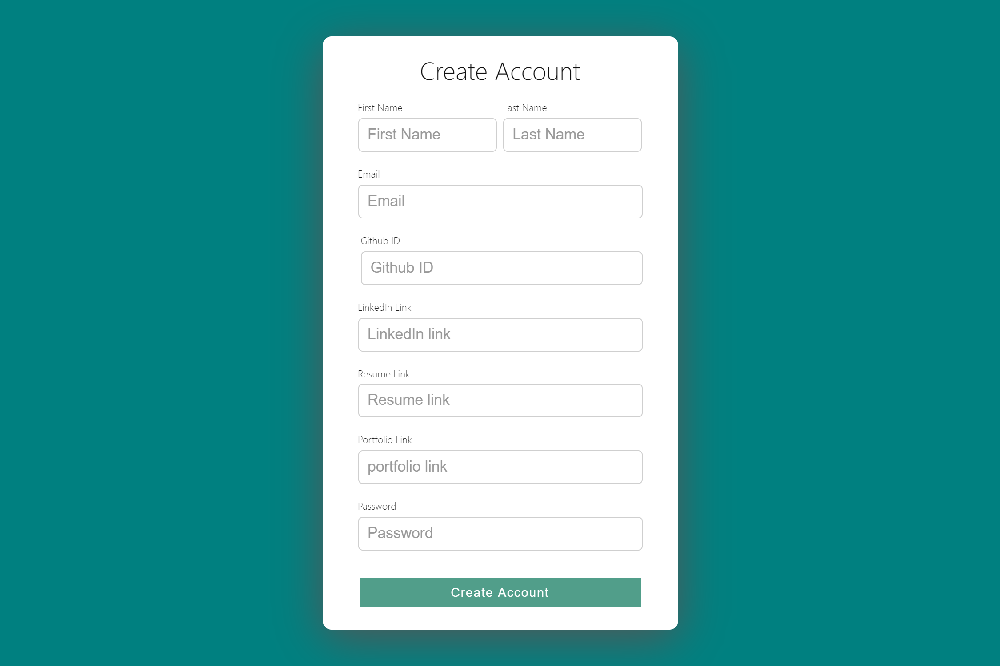
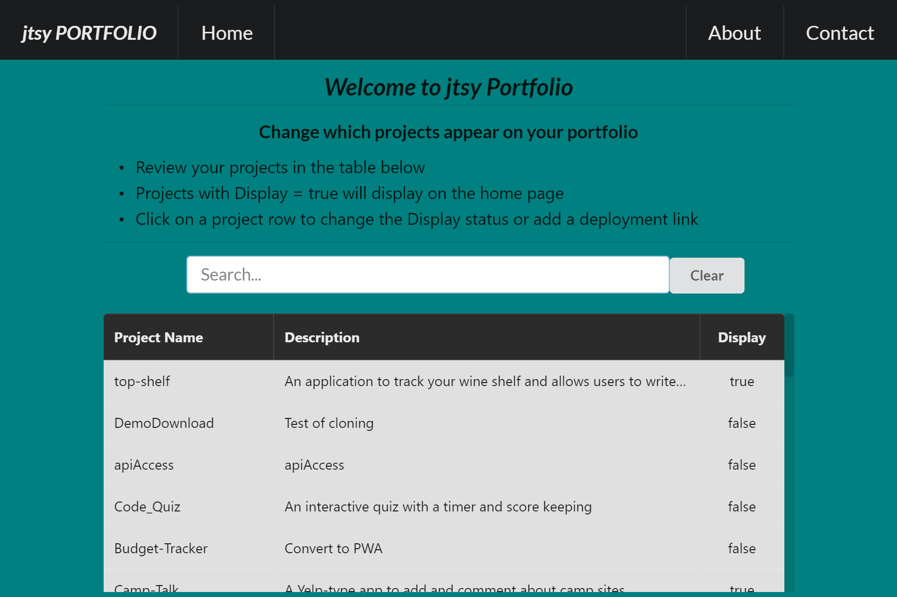
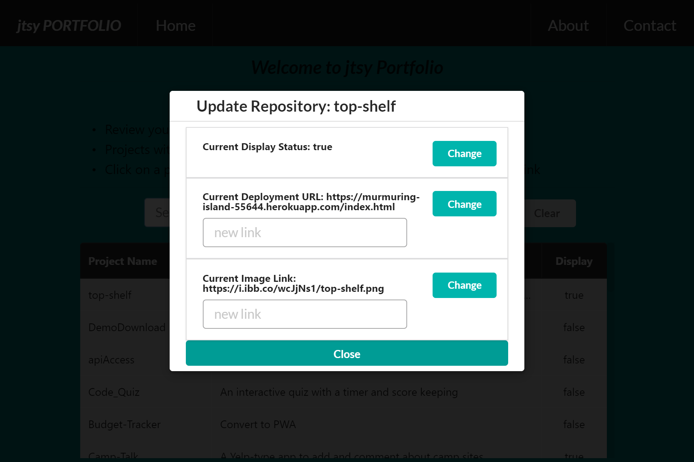
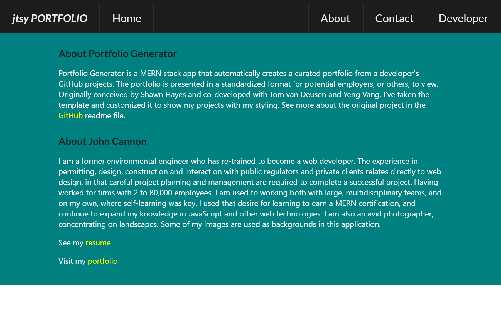
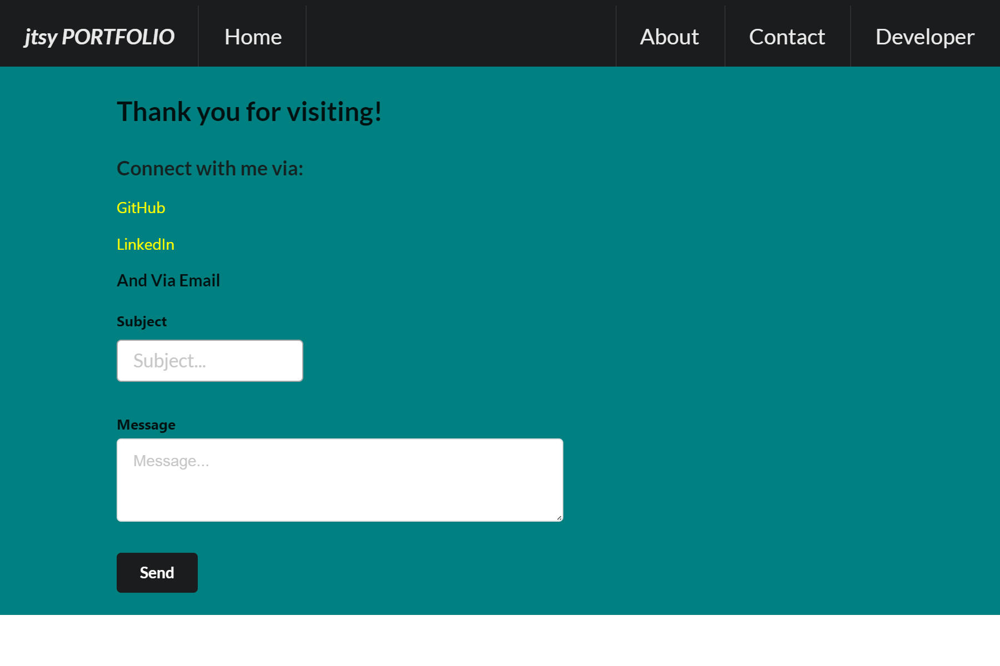

# jtsy-Portfolio  

## Description

Portfolio Generator is an app that automatically creates a curated portfolio from a developer's GitHub projects. The portfolio is presented in a standardized format for potential employers, or others, to view. The app imports all of a user's repositories, and allows you to choose which to highlight on the home page. Different projects can be shown for different viewers.

### Installation

- Install node.js and mongoDB on your local machine
- Clone the repository to your local machine
- npm install
- npm start to open the app locally
- Apply your own styling and links as needed

### How Portfolio Generator Works

This application uses the GitHub user name to retrieve all of a developer's projects, including shared projects. On the Developer page, the user will see table of the repositories. The 'activeFlag' determines if that project will be shown on the home page. Clicking on a row selects that project and allows the user to change the 'activeFlag' to true, and to add deployment link, if different from the link on the GitHub repository page. An image representing the project can be added to include on the home page.

### Technologies Used

Profile Generator is a full-stack application, using the following:

- MongoDB
- Express.js
- React.js
- Node.js
- Mongoose
- Semantic-ui-react
- React-bootstrap
- axios
- concurrently
- Nodemon

### Heroku Deployment

This application is designed for deployment on heroku. You must have an account on heroku and install the heroku CLI before deploying.

### Usage

#### Getting Started

The first time you type "`npm start`" you will be prompted to enter your GitHub username.

#### Create Account or Sign In

You are then prompted to create an account (or sign in if you have already created an account). An account is needed so that your GitHub username is retained in the Mongo database. The database retains your curated list of projects to publish to your portfolio.

#### Developer Page

Once you have created an account or signed in, you will see a list of your GitHub projects (repositories) on the developer page. The columns are sortable, and the search box find projects using key words.

#### Project Page

When a project is selected by clicking on it's row in the table, a modal dialog appears that allows the user to change the display status, deployment link, or image link to be included on the home page.

#### Home Page

The selected projects are now displayed on the home page. The user's name is dynamically rendered from the account settings, as are the links to the code (GitHub repository) and deployed application.

#### About Page

This page is about the user. It can be customized as needed to individualize the presentation. The resume and portfolio links are dynamically provided from the account settings.

#### Contact Page

This page provides links to the user's GitHub and LinkedIn pages, and an email form. The links and email address are provided from the account settings.

### Features

This application is intended to provide a template to be used to develop a project portfolio. The user can choose from any GitHub project and feature it on the home page. The styling can be modified to suite the user.

## Contributors

The original concept was conceived by Shawn Hayes.

John Cannon  
<a href="https://github.com/frunox/" alt="John Cannon's GitHub Projects">John's GitHub Projects</a>

Shawn Hayes  
<a href="https://github.com/srfrog1970/" alt="Shawn Hayes' GitHub Projects">Shawn's GitHub Projects</a>

Tom van Deusen  
<a href="https://github.com/shininglite/" alt="Tom van Deusen's GitHub Projects">Tom's GitHub Projects</a>

Yeng Vang  
<a href="https://github.com/YengHV/" alt="Yeng Vang's GitHub Projects">Yeng's GitHub Projects</a>

## License

This source code is available under the standard <a href="https://opensource.org/licenses/MIT">MIT license</a>

## Total GitHub Downloads

## Create React Application

This project was bootstrapped with [Create React App](https://github.com/facebook/create-react-app)
